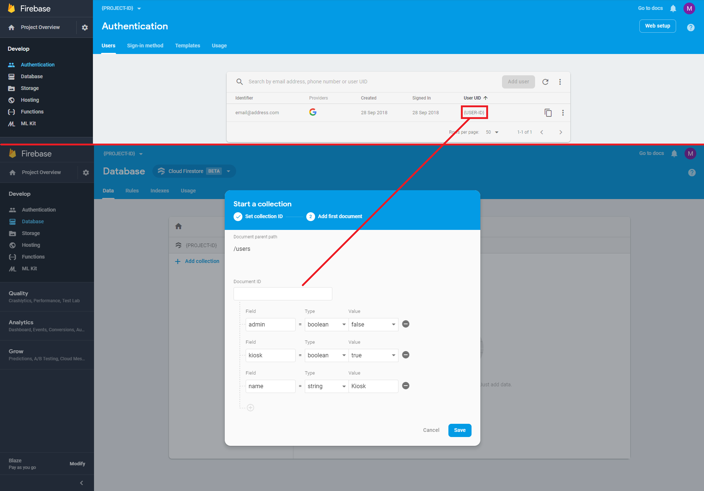

# Configuring Firebase

## Setup

You will need to set up a new firebase project (https://console.firebase.google.com) and enable the following features:

- Authentication (With Google and Email signin)
- Database (Firestore)
- Storage
- Hosting
- Functions

Note that you will not need to run `firebase init` as suggested during setup of certain features, because the project is already initialised with a .firebaserc file

## Configuration

## Environment variables

You should create a `.env` file in the project root according to the `.env.tmpl` file. This needs populating with your firebase project ID and API key. Instructions for doing so can be found in the [template file](../.env.tmpl). When building the application, these values will be compiled into the javascript.

(If successful, `npm start` will now get you to an error page within the app)

## Billing

The Firebase functions we use make API calls to slack. As this is an external network request, you will be required to enable billing on your firebase account and change your plan to the Blaze pay-as-you-go pricing plan (or better).

As with any pricing plan, make sure you get approval from whoever is responsible for paying for any charges.

## Storage

Storage rules will be automatically configured when you deploy the application to firebase (see below).

However, you will also need to configure the lifecycle and CORS settings.

To do so you must first install `gsutil` from [here](https://cloud.google.com/storage/docs/gsutil_install).

Now you need to set up gsutil to use your account. Run: 
```
$ gsutil config
```

And follow the instructions for logging in with your Google account and setting up a Cloud Platform.

When you initialise storage in your console, you will get a default bucket with the name "gs://<PROJECT_ID>.appspot.com".

Now add a new bucket to your storage. This will be a directory for storing your snackchat data, to which we then apply a lifecycle via gsutil, so that any images will be cleared out after 24 hours.

Navigate to this directory in your terminal before running the following 2 commands:

```shell
{HONESTY_DIR}\firebase $ gsutil lifecycle set lifecycle.json gs://<SNACKCHAT_BUCKET>
{HONESTY_DIR}\firebase $ gsutil cors set cors.json gs://<PROJECT_ID>.appspot.com
```

Note: The last command configures CORS to allow requests from any URL. This is useful for debugging purposes and running the front end locally but may not be desirable in production. You can modify [`cors.json`](cors.json) to allow specific domains if needed.

You will also need to update storage.rules to reference your buckets correctly.

A storage.rules file exists, you want to replace the following lines with the correct ids for your storage buckets.
```
  ...
  match /b/{SNACKCHAT_BUCKET}/o {
  ...
  match /b/{PROJECT_ID}.appspot.com/o {
  ...
```

Storage is currently used to save the training data, evaluation data and snackchats (deleted after 24 hours)

Note that, as you're storing the snackchat messages separately (in order to take advantage of the lifecycle behaviour), you'll also need to ensure the "{SNACKCHAT_DIR}" section of the rules is applied to that storage bucket.

(Failing to do this means that the image data is not publicly visible to slack, so you'll get the text, but not the images)

## Authentication

For the purpose of authenticating the kiosk to make calls to our firebase functions, you should create an Email/Password user account.

## Functions

In order to set the environment variables for your firebase functions you will need to install the `firebase-tools` package from npm by using the following command:

```shell
$ npm install -g firebase-tools
```

To set up calls to Slack, legacy token which can be generated [here](https://api.slack.com/custom-integrations/legacy-tokens#legacy-info)

You will then need to run:
```
{HONESTY_DIR}\functions $ npm install
{HONESTY_DIR}\functions $ firebase use {PROJECT_NAME}
```
to initialise the firebase-functions module and set up your target project as the one the following firebase commands will affect.

Now run the following

```shell
{HONESTY_DIR}\functions $ firebase functions:config:set slack.token=SLACK_TOKEN
{HONESTY_DIR}\functions $ firebase functions:config:set snackchat.storageurl=gs://<SNACKCHAT_BUCKET>
```

## Deployment

The following command will update your firebase with the changes specified above. If you haven't built your code, you will get an error when it tries to deploy the site to hosting, but this will still allow you to run the site via localhost.
```
{HONESTY_DIR} $ firebase deploy
```

## Database

### Add a kiosk user

Now the firebase functions are correctly initialised, you will need to manually add a kiosk user.

Add an email/password entry to the sign-in method on the authentication screen for the kiosk's account.

Create a `users` collection in the database


 Add a document with the `Document ID` set to the kiosk's `User UID` from the authentication entry.

In that document, add these fields.

```
  admin: false
  kiosk: true
  name: "Kiosk"
```



### Short/Blacklist

The database will require a `slack_users` collection, which can simply be left empty, this is to filter the list of slack accounts to remove people who do not want to be listed. To add or remove users from the slack short/black lists, add a `slack_users` collection, add a `short_and_black_list` document, and add fields in this form.
```
<slackusername1>:"SHORT_LIST"
<slackusername2>:"BLACK_LIST"
```

### Training Data

`training_data` will be automatically created by the app.

The database is used to track training data. There is no way of listing files in storage so each entry keeps track of one image. To give people admin/kiosk privileges add the relevant Boolean flags to the document titled with their UID in users collection. When users is updated a cloud function is triggered to update the [custom claims](https://firebase.google.com/docs/auth/admin/create-custom-tokens) of that user, so don't store too much information here. Custom claims is what handles the firebase and storage rules.

